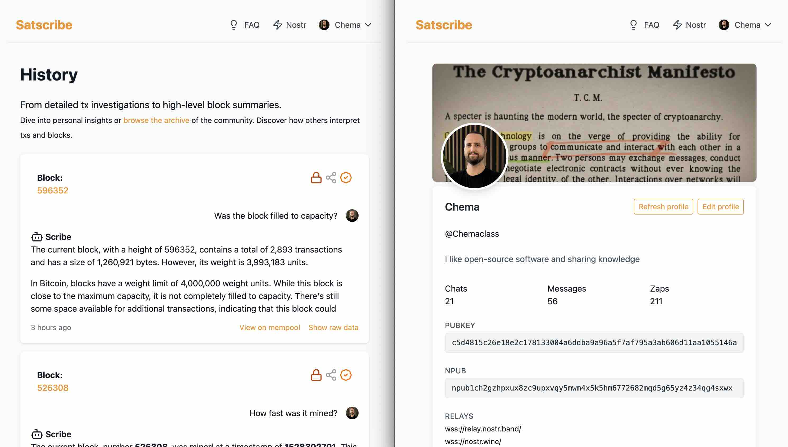

# 🧠 Satscribe

**Satscribe** is a web application that transforms Bitcoin blocks and transactions into insightful, human-readable conversations.

Enter a transaction ID , block hash, or block height. The app fetches the blockchain data via the Blockstream API and generates a plain-language explanation using OpenAI. Each chat is stored, so you can revisit or share it anytime.

Satscribe doesn’t require user accounts or passwords. Instead, it leverages the Nostr protocol to establish ownership of chats in a decentralized, privacy-friendly way.

---

## 🚀 Features

- 🔎 Search the blockchain by **txID**, **block hash** or **height**
- 🤖 Chat-powered summaries using GPT-4o
- 🌐 Fetches data from Blockstream and CoinGecko
- 💬 Ask follow-up questions and pick a persona (Educator, Developer, Storyteller)
- 💾 Chats are saved and can be shared or kept private
- 📈 Shows the latest block height and BTC price
- ⚡️ Lightning tipping after the free quota is reached
- 🗂️ View and search your previous chats
- 🔐 Login via Nostr

## 🖼️ Demo




---

## 📦 Requirements

- PHP 8.2+
- Composer
- Node.js 20+ and npm
- SQLite
- Laravel 12.x
- OpenAI API Key

---

## ⚙️ Installation

```bash
git clone https://github.com/Chemaclass/satscribe.git
cd satscribe

composer install
npm install
cp .env.example .env
php artisan key:generate
```
Then configure your .env
```dotenv
DB_CONNECTION=sqlite

OPENAI_API_KEY=sk-...
OPENAI_MODEL=gpt-4o
```
And migrate the DB:
```bash
php artisan migrate
```

Run the app for local development:
```bash
composer dev
```

## ▶️ Usage

Once the server is running, open **http://localhost:8000** and start a chat by entering a TXID, block hash or height. The assistant summarizes the data, and you can ask follow-up questions. All chats are stored and listed on the **History** page.

## 🔑 Nostr Login

If your browser doesn't have a Nostr extension, you can still sign in with your private key or generate a new priv/public key to be temp stored in your local storage – more about it [here](https://satscribe.app/nostr).

## 🧪 Testing

Run the automated test suite with:

```bash
composer fix && composer test
```

## 🔧 Git hooks

Run formatting and tests automatically before each commit by enabling the
provided pre-commit hook:

```bash
git config core.hooksPath githooks
```

## 🏛️ Architecture

See [docs/architecture.md](docs/architecture.md) for an overview of the module structure and suggested improvements.


## 🤝 Contributing

Bug reports and pull requests are welcome. Please read the
[CONTRIBUTING](.github/CONTRIBUTING.md) guide and our
[Code of Conduct](.github/CODE_OF_CONDUCT.md) before participating.

## 📄 License

The project is released under the [MIT](LICENSE) license.
