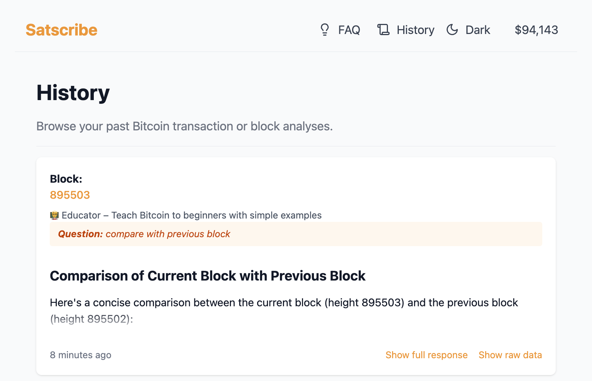

# 🧠 Satscribe

**Satscribe** is a PHP app that takes a Bitcoin transaction ID or block height, fetches blockchain data, and generates an AI-written paragraph describing it — using OpenAI's GPT models. It also stores all descriptions in a database for easy reference.

---

## 🚀 Features

- 🔎 Input a **TXID** or **block height**
- 🧠 AI-generated paragraph using GPT-4
- ⛓️ Uses the [Blockstream.info API](https://github.com/Blockstream/esplora/blob/master/API.md) for Bitcoin data
- 💾 Saves each description to the database
- 🗂️ View and paginate all previous descriptions
- 🔐 Login via Nostr extension with challenge signing

## 🖼️ Demo




---

## 📦 Requirements

- PHP 8.2+
- Composer
- SQLite
- Laravel 12+
- OpenAI API Key

---

## ⚙️ Installation

```bash
git clone https://github.com/Chemaclass/satscribe.git
cd satscribe

composer install
cp .env.example .env
php artisan key:generate
```
Then configure your .env
```dotenv
DB_CONNECTION=sqlite

OPENAI_API_KEY=sk-...
OPENAI_MODEL=gpt-4o-mini
```
And migrate the DB:
```bash
php artisan migrate
```

Run the app for local development:
```bash
composer dev
```

## ▶️ Usage

Once the development server is running visit **http://localhost:8000** in your
browser. Enter a Bitcoin transaction ID or block height in the form and the
application will fetch the blockchain data, send it to OpenAI and display a
short summary. Every generated paragraph is stored so you can review it later in
the **History** page.

## 🧪 Testing

Run the automated test suite with:

```bash
composer test
```

Static analysis can be executed with:

```bash
composer phpstan
```

## 🔧 Git hooks

Run formatting and tests automatically before each commit by enabling the
provided pre-commit hook:

```bash
git config core.hooksPath githooks
```

## 🏛️ Architecture

See [docs/architecture.md](docs/architecture.md) for an overview of the module structure and suggested improvements.


## 🤝 Contributing

Bug reports and pull requests are welcome. Please read the
[CONTRIBUTING](.github/CONTRIBUTING.md) guide and our
[Code of Conduct](.github/CODE_OF_CONDUCT.md) before participating.

## 📄 License

The project is released under the [MIT](LICENSE) license.
