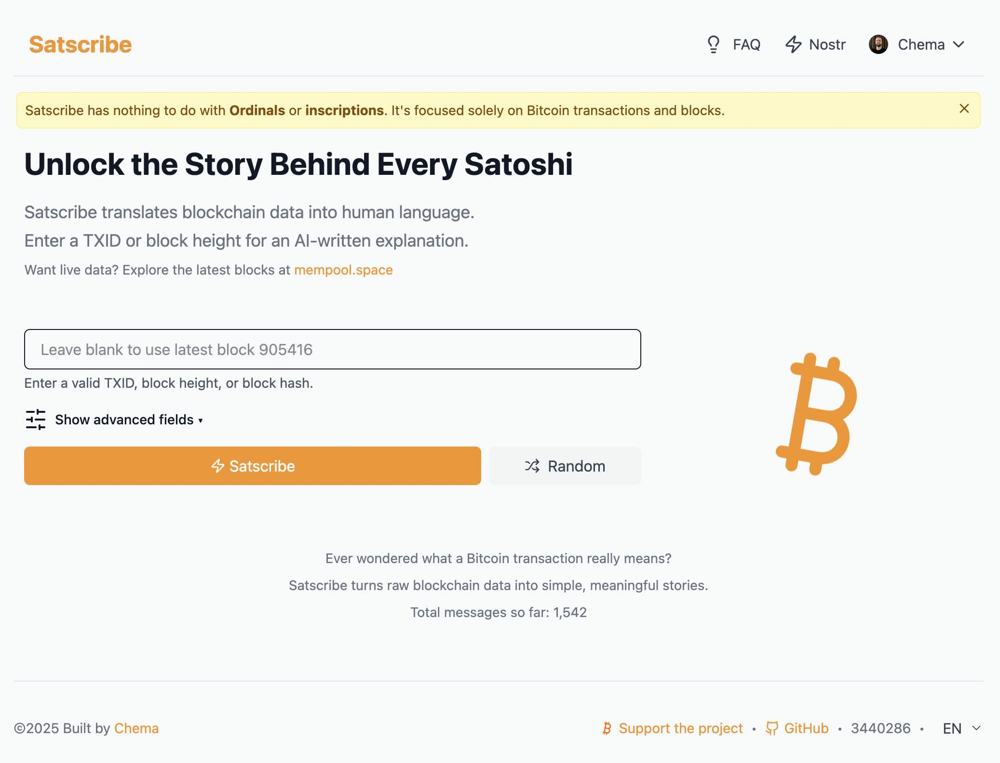
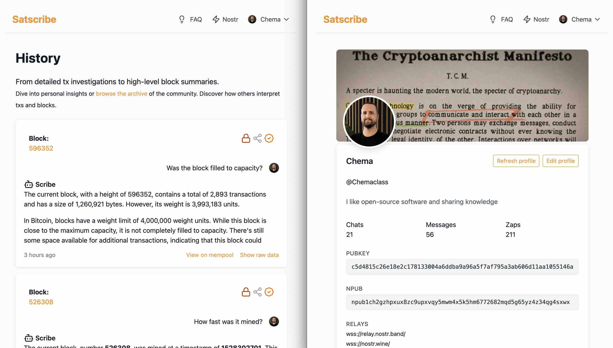

# 🧠 Satscribe

**Satscribe** is a web application that transforms Bitcoin blocks and transactions into insightful, human-readable conversations.

Enter a transaction ID, block hash, or block height. The app fetches the blockchain data via the Blockstream API and generates a plain-language explanation with an AI model. Each chat is stored, so you can revisit or share it anytime.

Satscribe doesn’t require user accounts or passwords. Instead, it leverages the Nostr protocol to establish ownership of chats in a decentralized, privacy-friendly way.

---

## 🚀 Features

- 🔎 Search the blockchain by **txID**, **block hash** or **height**
- 🤖 Streaming AI summaries from **OpenAI**, **Groq** or **OpenRouter**
- 🆓 Free-tier models by default — or bring your own API key
- 🌐 Fetches data from Blockstream and CoinGecko
- 💬 Ask follow-up questions and pick a persona (Educator, Developer, Storyteller)
- 💾 Chats are saved and can be shared or kept private
- 📈 Shows the latest block height and BTC price
- ⚡️ Lightning tipping after the free quota is reached
- 🗂️ View and search your previous chats
- 🔐 Login via Nostr

## 🖼️ Demo





---

## 📦 Requirements

- PHP 8.2+
- Composer
- Node.js 20+ and npm
- SQLite
- Laravel 12.x
- An API key for **one** AI provider — see [AI providers](#-ai-providers)

---

## 🤖 AI providers

Satscribe talks to any OpenAI-compatible chat-completions API. Three are
allowlisted; a provider not in that list can never become an outbound request.

| Provider | Env var | Free tier |
|---|---|---|
| Groq | `GROQ_API_KEY` | ✅ every listed model — Llama 3.3 70B, GPT-OSS 120B/20B, Kimi K2, Llama 3.1 8B |
| OpenRouter | `OPENROUTER_API_KEY` | ✅ GPT-OSS 20B, Gemma 4 31B, Nemotron 3 Super 120B |
| OpenAI | `OPENAI_API_KEY` | ❌ paid only |

Within each provider the free models are listed first and the paid ones
cheapest-first, so the least expensive option is always the one nearest the top.

Set **at least one**. When a free-tier key is present it becomes the default, so
the app never spends OpenAI credit unless that is the only key configured.
`free` means "costs nothing at the provider's free tier" — every provider still
requires a key.

Visitors can also supply their own key in the model picker. It is kept in
`localStorage`, sent as an `X-Ai-Api-Key` header, and is never logged or stored
server-side.

---

## ⚙️ Installation

```bash
git clone https://github.com/Chemaclass/satscribe.git
cd satscribe

composer install
npm install
cp .env.example .env
php artisan key:generate
```
Then configure your .env. A free Groq key is the quickest way to a working install:
```dotenv
DB_CONNECTION=sqlite

# Pick at least one provider
GROQ_API_KEY=gsk_...
# OPENROUTER_API_KEY=sk-or-...
# OPENAI_API_KEY=sk-...
# OPENAI_MODEL=gpt-4o-mini
```
And migrate the DB:
```bash
php artisan migrate
```

Run the app for local development:
```bash
composer dev
```

## ▶️ Usage

Once the server is running, open **http://localhost:8000** and start a chat by entering a TXID, block hash or height. The assistant summarizes the data, and you can ask follow-up questions. All chats are stored and listed on the **History** page.

## 🔑 Nostr Login

If your browser doesn't have a Nostr extension, you can still sign in with your private key or generate a new priv/public key to be temp stored in your local storage – more about it [here](https://satscribe.app/nostr).

## 🧪 Testing

`composer test` is the gate: it runs PHPStan (level 8 over `app`, `modules` and
`tests`) followed by PHPUnit.

```bash
composer fix && composer test          # format, then the full gate
composer phpstan                       # static analysis only
vendor/bin/phpunit --testsuite=unit    # fast loop
vendor/bin/phpunit --filter <name>     # one class or method
```

Unit tests mock the interfaces in each module's `Domain/` and never touch the
database or the network; anything needing the framework is a feature test.

## 🔧 Git hooks

Run formatting and tests automatically before each commit by enabling the
provided pre-commit hook:

```bash
git config core.hooksPath githooks
```

## 🏛️ Architecture

Business logic lives in `modules/`, each split into `Domain`, `Application` and
`Infrastructure`, with dependencies pointing one way:
**Infrastructure → Application → Domain**. See
[docs/architecture.md](docs/architecture.md) for the module map and the rules
that keep those boundaries.

## 📝 Changelog

Notable changes are listed in [CHANGELOG.md](CHANGELOG.md). The project deploys
continuously from `main` and does not tag versions.

## 🤝 Contributing

Bug reports and pull requests are welcome. Please read the
[CONTRIBUTING](.github/CONTRIBUTING.md) guide and our
[Code of Conduct](.github/CODE_OF_CONDUCT.md) before participating.

## 📄 License

The project is released under the [MIT](LICENSE) license.
